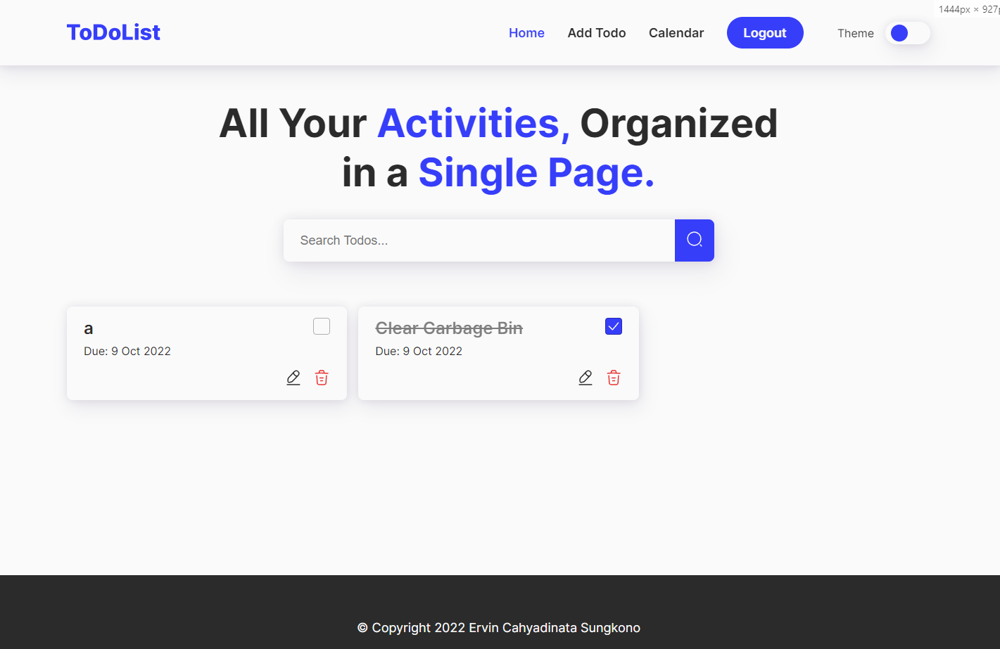
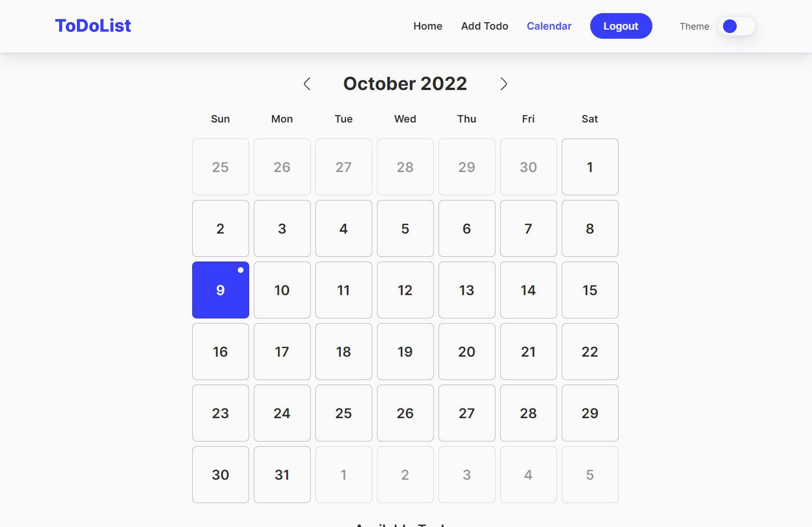

# Todo App
Todo App made using React and SASS. This app uses API from my other repository [Here](https://github.com/ervin-sungkono/Todo-App-API).

## Features
1. Authentication Page
2. CRUD Todo
3. View Calendar
4. Responsive Layout
5. Dark Mode

## Setup
1. Clone Repository
```sh
git clone https://github.com/ervin-sungkono/Todo-App.git
```
2. Install Packages
```sh
npm install
```
3. Run App
```sh
npm start
```

## Preview Image


